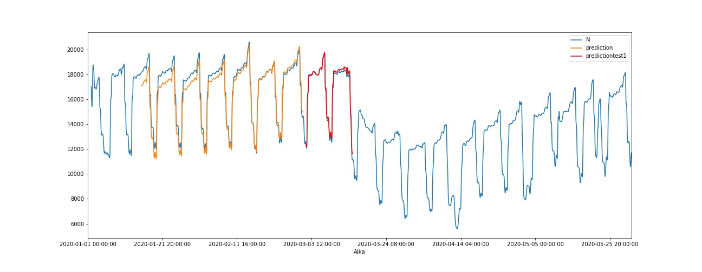
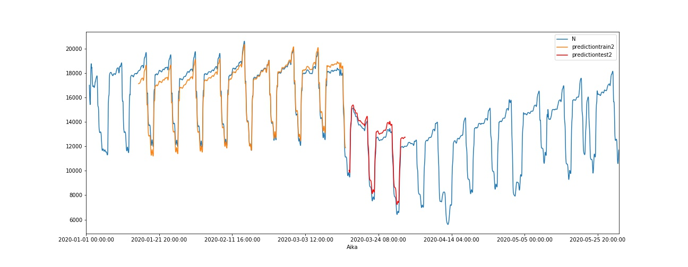
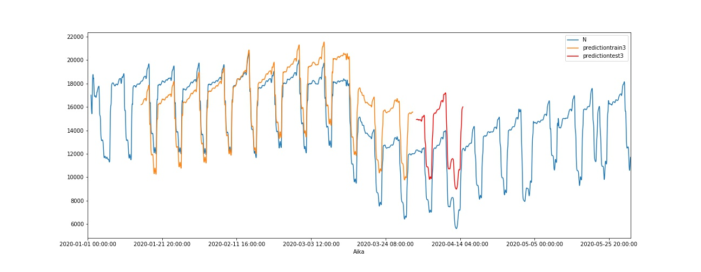

### Aim of this project:

Show one case of how machine learning predictions handle when the data changes
in a clear way. We use these predictions in many things from our recommendations
on Amazon to recruitment and sometimes sentencing recommendations. However, the
data that is at the very base of these can change dramatically for many reasons.
My main reason for doing this was to see, how a simple linear algorithm handles
this change and how fast it adapts.

### Data

LAM-data gathered from: https://aineistot.vayla.fi/lam/reports/LAM/
Reports from several points were gathered, preprocessed and analysed using 
linear regression. First the learning data was jan-march 2020 and the first 2 weeks
of March was predicted. In the next phase the learning data was jan to 
mid-march 2020 and the second half of march datapoints was predicted. A new
prediction was made every two weeks always adding the real data for the 
previously predicted weeks to be part of the learning data and predicting the 
next two weeks. The final prediction was for the last part of May 2020.

### Data pipeline

The data was downloaded by hand from the previously mentioned website.
It was then preprocessed as shown in lam-predict-preprocessing.ipynb .
Then the rest is done in lam-linear-regression.ipynb

## Results

### What the error rates show

Error rates are an indicator to the accuracy of our model. MAE means mean 
absolute error and it tells us how big of an error we can expect from the 
forecast on average. RMSE (Root Mean Square Error) is the standard deviation 
of the residuals, aka prediction errors, which tell us how far from the 
regression line data points are, so it is a measure of how spread out these
residuals are and how concentrated the data is around the line of best fit.

The models have fairly small error-rates at first (MAE and RMSE - see image 1 below)
in the prediction concerning the first two weeks of March. The next prediction
is showing a slightly larger error rate for the end of March. The big difference
comes after that with the modeling showing significantly higher error rates
for both April predictions, with error rate going slightly down with the second.
What I find very interesting is that by the first May prediction, the error
rates have gone down to the last prediction in March and by the last prediction
the model seems to have recovered and is as accurate now as it was in the beginning.

Image 1: MAE and RMSE showing the error rate in models.

### What the predictions show

The situation is quite clear when looking at the plots depicting the actual traffic amount 
(in blue) to the predictions. In the images below the orange line depicts the predictions 
made with the training data and the red shows the predictions of the test-data. The story
is the same shown here as was in the error rates. The predictions start to go off in the
second one. The third is clearly off and so is the fourth as well. The fifth is clearly
better and the sixth is still an improvement on the fifth. I've used rolling averages
to produce clearer visualisations as the amount of traffic varies greatly within each 24 hour
cycle.

Image 2: Prediction 1 - first 2 weeks of March

Image 3: Prediction 2 - last 2 weeks of March

Image 4: Prediction 3 - first 2 weeks of April

Image 5: Prediction 4 - last 2 weeks of April

Image 6: Prediction 5 - first 2 weeks of May

Image 7: Prediction 6 - last 2 weeks of May

### What I learned doing this

I am learning to utilise functions better instead of writing boilerplate code.
I noticed that actually the predictions do "go off" when the data changes,
but by bringing in new data helps fix the situation quite fast. So my main
takeaway from this is the importance of building mechanisms in models that 
retrain and redeploy the model so it stays currant. Also vital are indicators
and warnings that a model is not performing well. Building these will need a 
new project.

### Author and date

Satu Korhonen June-July 2020

